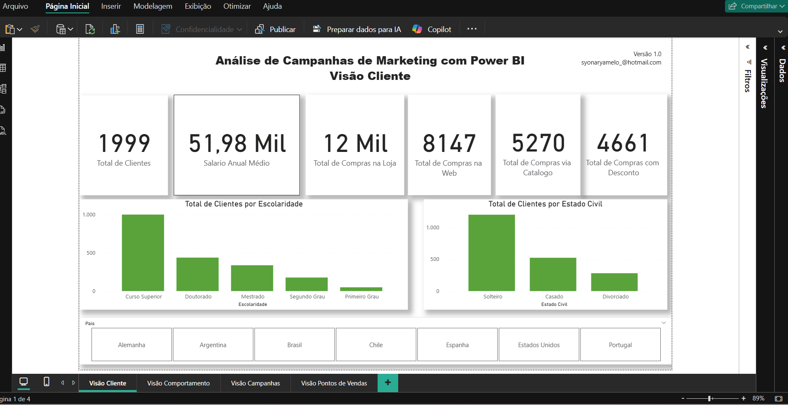
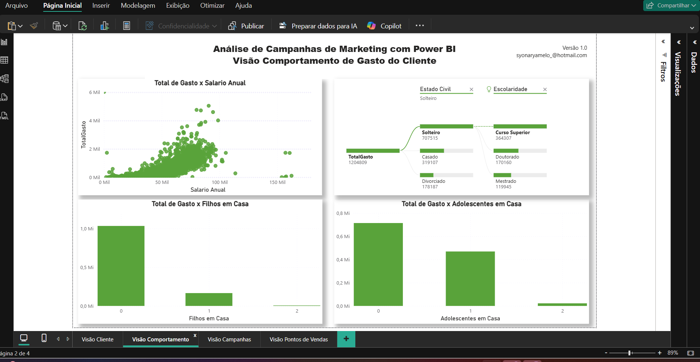
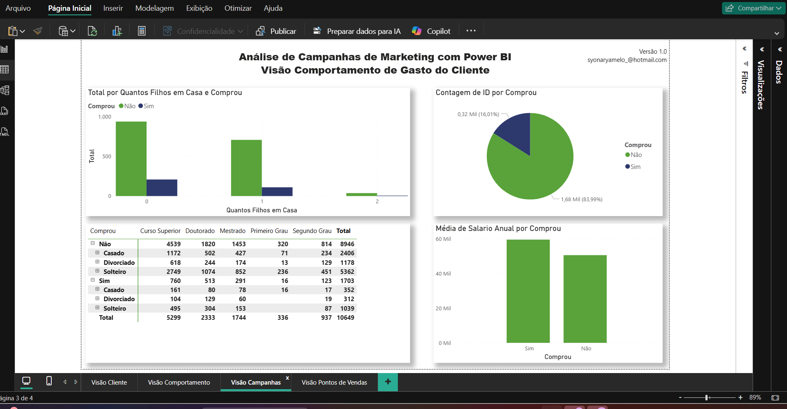
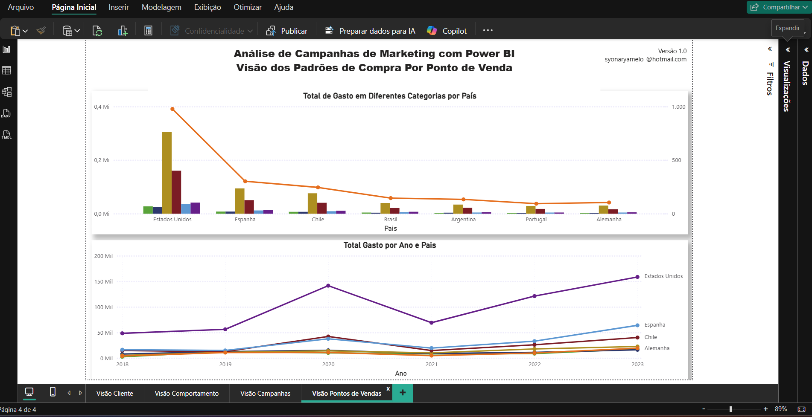

# Análise de Campanhas de Marketing com Power BI

[](https://powerbi.microsoft.com/)
[](https://www.datascienceacademy.com.br/)

Mini-Projeto de  **análise de campanhas de Marketing com o Power BI**.

O projeto apresenta **4 Dashboards**, com **10 elementos visuais**, customizações, formatações, correções nos dados e diferentes recursos do Power BI.  

Os dados foram **customizados** para este Mini-Projeto e representam informações sobre clientes e campanhas de Marketing realizadas por uma empresa.

---

## 🎯 Objetivo
Para cada visão, vamos compreender as variáveis, criar gráficos, medidas, extrair métricas e cruzar os dados, visando entregar aos tomadores de decisão uma visão completa sobre:  
- **Perfil dos clientes**  
- **Padrões de compra**  
- **Efetividade das campanhas de Marketing**

---

## 🖥️ Visões e Dashboards

Serão criados diversos relatórios divididos em **4 visões**:

### 1. Visão do Cliente
- Compreensão das variáveis relacionadas aos clientes.
- Criação de gráficos e métricas para análise individual.
  


### 2. Visão do Comportamento de Compra do Cliente
- Análise do comportamento de compra ao longo do tempo.
- Cruzamento de dados para identificar padrões.
  


### 3. Visão da Performance das Campanhas de Marketing
- Avaliação da efetividade das campanhas.
- Indicadores e métricas de performance.
  


### 4. Visão dos Padrões de Compra no Ponto de Venda (País)
- Análise geográfica e por ponto de venda.
- Extração de insights sobre padrões de compra.
  



---

## 🛠️ Tecnologias utilizadas
- **Power BI** – Criação de dashboards, gráficos e medidas.  
- **Excel / CSV** – Fonte de dados utilizada.  
- **Power Query** – Transformação e limpeza de dados.  

---

## 🚀 Como abrir os dashboards
1. Baixe ou clone este repositório:
```bash
git clone https://github.com/SyonaryaMelo/Dashboard-Marketing.git
```

2. Abra o Power BI Desktop.

3. Abra o arquivo .pbix correspondente ao dashboard.

4. Explore os gráficos, filtros e visualizações interativas.
